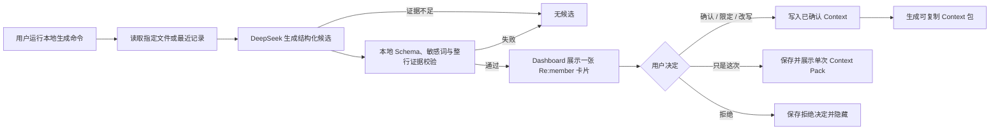

# Memento Context Agent MVP PRD

> 文档状态：P1.0 产品合同（与当前 MVP 实现对齐；真实 API 集成已验证，真实用户价值仍待验证）
> 适用范围：P1「Re:member 卡片」与 P2「Context 包」的最小闭环
> 本文将当前 P1.0 与后续 P1.1 明确分开；“产品需要”不自动等于“本次已实现”。

## 0. 统一产品叙事口径

本文遵循 [Memento 产品叙事统一口径](MEMENTO_PRODUCT_NARRATIVE.md)。第三项用户价值统一表述为 **“让每个 AI，都从同一个你开始”**，对应的产品能力是 **“可调用的个人记忆”**。

本 PRD 只验证这项价值的最小前置闭环：从带证据的理解候选，到用户确认的 Context，再到可复制的 Context Pack。跨 AI 自动接入、按任务检索和双向回流仍属于后续能力。

## 1. 一句话定义

Context Agent 是一个有边界的本地 Agent：它只从用户明确授权的原始记录中提出至多一条、带原文证据的理解候选；只有经过用户确认或修改的内容，才可以进入长期 Context，并在未来任务中被透明地复用。

这个 MVP 聚焦一件更小的事：

> 用户是否愿意校准 AI 对自己的局部理解，以及这些已确认的理解能否减少下一次任务中的重复说明。

## 2. 问题与机会

Memento 已经保存用户主动留下的日级原始事实，并明确要求不修改原始 `YYYY-MM-DD.md`。当前缺少的是从“记录”到“可被未来任务安全使用的 Context”的闭环。

单纯把全部记录交给模型有三个产品问题：

- 模型可能把一次性行为概括成长期偏好；
- 用户不知道某个结论来自哪段原文；
- 错误理解可能在后续回答中被反复放大。

因此，MVP 不追求“记得最多”，而追求“每条被使用的理解都有来源、范围和用户决定”。

## 3. 产品目标

### 3.1 P1.0 必须完成

1. 从用户明确选择的同日或近几日文本记录中，生成零条或一条理解候选。
2. 候选只能属于项目决定、已写明的约束或工作偏好，并必须附带可逐字核对的原始证据。
3. 用户可以选择“是的 / 只是这次 / 限定范围 / 改一下 / 不要记住”。
4. 只有确认、限定或用户改写后的内容可以进入长期 Context；“只是这次”保存可展示/复制的单次 Context Pack，但不进入长期 Context；拒绝只保存决定。
5. 用户可从仍有效的已确认 Context 生成可复制的 Context 包；CLI 版本包含原始证据定位，Dashboard 版本包含 Context ID、表述、范围与类别。
6. 能记录不含正文的真实 Provider Token 与成本数据，以支持模型成本评估。

### 3.2 P1.1 后续补齐

- 撤回、修订版本与完整审计入口；
- “只是这次”被使用后自动消费/过期；
- Context 包按任务语义检索、逐条勾选与就地纠正；
- 生成前预览实际出站文本与更细的授权范围；
- 跨 CLI / Dashboard 的统一 CAS 与恢复协议；
- 不含正文的真实复用事件。

### 3.3 成功标准

工程成功与产品成功分开判断：

- 工程成功：P1.0 数据合同、证据校验、五种决定、单进程幂等、权限边界和失败不误写通过自动化测试。
- 集成成功：真实 DeepSeek API 调用能稳定返回可校验结果，并产生真实 Token 与成本记录。
- 产品成功：目标用户在真实未来任务中复用了已确认 Context，并认为它减少了重复说明。这个结论只能来自用户测试，不能由合成样例或一次 API 调用替代。

## 4. 非目标

本 MVP 不做：

- 自动构建完整人格、价值观、身份或心理画像；
- 后台持续录屏、监听或读取未明确授权的文件；
- 读取截图、录音、照片或浏览器历史来推断 Context；
- 自动替用户发消息、下单、付款、预约或调用外部业务服务；
- 在没有用户确认时，把模型推断写入长期 Context；
- 自动修改原始日记或 Daily Review；
- 自动跨设备同步或向多个 AI 服务分发 Context；
- 用向量数据库、知识图谱或多 Agent 编排来扩大技术范围；
- 证明“AI 已经理解用户”这一宽泛命题。

## 5. 首要用户与首个场景

首要用户沿用现有路线图：高频使用 AI、跨聊天/文档/代码工作、经常重复解释项目背景，并在意错误理解与数据所有权的 Mac 知识工作者。

首个场景：

> 用户昨天记录了一项产品决定及其依据。今天开始相关任务时，Context Agent 提供一份可复制的 Context 包，包含用户已确认的决定与适用范围；CLI 包还附原始证据定位，当前 Dashboard 长期包不含原始引文。用户不必再次从头解释。

## 6. 核心对象

| 对象 | 含义 | 是否可被模型直接改写 |
|---|---|---|
| 原始事实 | 用户写入 `YYYY-MM-DD.md` 的内容 | 否 |
| 理解候选 | 模型提出、尚未获得用户许可的局部解释 | 可重建，但不能当作长期事实 |
| 用户决定 | 用户对候选的确认、限定、改写、单次使用或拒绝 | 否；P1.0 每个候选保存一个终态决定 |
| 已确认 Context | 用户授权未来复用的内容，带范围与证据 | P1.0 不支持修订版本或撤回 |
| Context 包 | 从当前有效 Context 中确定性组装的只读输出 | 可重建 |

Daily Review 是日级回看结果，不是本 MVP 的证据源。候选必须回到原始事实层进行核对。

## 7. 用户流程

### 7.1 流程 A：生成候选

1. 用户主动运行本地命令，并可通过 `--source` 指定日级文件；未指定时读取最近记录。
2. 命令把所选文本发送给 DeepSeek。P1.0 尚没有调用前的逐段预览，因此使用默认“最近记录”前需要用户理解该范围。
3. 没有足够证据时返回 `no_candidate`；这不是失败。
4. 只有通过本地 Schema、敏感边界、文件行号和整行引文校验的候选才写入本地并可被 Dashboard 展示。

### 7.2 流程 B：校准候选

卡片展示候选表述、适用范围、为何现在出现、原始证据和五种回应。它以“候选 · 尚未记住”标识模型结论尚未获得授权。用户完成一个决定后，同一 Candidate ID 不再出现在待处理区。

### 7.3 流程 C：在未来任务中使用

1. Dashboard 从所有 `status=active` 的已确认 Context 生成预览或复制包；P1.0 不做逐条勾选。
2. CLI 可选传入精确范围；匹配该范围或 `global` 的 Context 才进入包。未传范围时包含全部有效 Context。
3. Dashboard 包包含 Context ID、表述、范围与类别；CLI 包额外包含文件、行号和整行引文。
4. “只是这次”会把 `one_time_context` 保存进决定文件；CLI 在响应中返回，Dashboard 可重建、展示并复制一份独立的 One-time Context Pack。它不会进入长期包，也不会在使用后自动删除。

### 7.4 P1.1：纠正与撤回

P1.0 没有撤回、Context 版本修订、逐条本次排除或完整审计页。当前若用户需要停止使用一条已确认 Context，只能手动管理本地 `Context/Confirmed/` 文件；这不属于完整产品交互。P1.1 需要提供显式撤回与修订，并保证不删除原始事实和历史决定。

## 8. 节点合同与必要性

| 节点 | 输入 | 处理 | 输出 | 失败策略 | 为什么必要 | 验收标准 |
|---|---|---|---|---|---|---|
| N0 显式触发 | 用户运行 CLI、可选 `--source` | 未指定来源时选择最近至多 7 个日级文件；安装本身不自动调用模型 | 一次生成请求 | 没有合法源文件则退出，不联网 | 把模型调用与用户动作绑定，避免安装即监控 | 不运行命令就没有 API 请求；输出列出本轮来源文件 |
| N1 来源快照 | `YYYY-MM-DD.md` | 读取整行文本、计算 SHA-256；调用后再次比对来源哈希 | 带行号输入与 `source_hashes` | 文件缺失、超限、越界链接或调用期间变化则退出 | 证明候选引用的是同一版原文 | 引文文件在 vault 根目录；保存候选前哈希仍一致；原文不被改写 |
| N2 结构化生成 | 来源文本、固定 Prompt、Schema | DeepSeek 返回 `candidate` 或 `no_candidate`，最多一条；Prompt 禁止敏感推断并把记录视为不可信数据 | Provider JSON 与 usage | P1.0 不自动重试；网络、鉴权或响应结构错误直接失败 | 模型只承担语义提炼，不拥有长期写入权 | JSON 根合同严格；模型失败不会产生候选或修改用户原文 |
| N3 本地确定性校验 | Provider JSON、当前源文件 | 校验字段、枚举、敏感标记/有限词法后备、文件、行号、整行逐字引文与来源哈希 | 已验证候选或安全错误 | 任一项不符即整条拒绝，不做模糊修补 | 模型自报证据必须由本地代码回查；两端必须执行同一版词法规则 | 展示的每条 quote 与指定原文整行完全一致；Python 与 Dashboard 对同一敏感样例同判；非法结果零候选落库 |
| N4 候选持久化 | 已验证候选、模型、Provider、来源哈希 | 计算稳定 Candidate ID 与 generation key；写入扁平 `status=candidate` JSON | 一个候选文件 | 同 ID 同内容复用，不同内容冲突退出 | 让 Dashboard 与 CLI 共享可审计对象，避免重复卡片 | 相同输入和候选得到相同 ID；每次生成至多新增一条候选 |
| N5 Re:member 卡片 | 未做决定的候选 | Dashboard 只选最新一条，显示表述、范围、类别、理由、原文证据与五种回应 | 待决定界面 | JSON 读失败时跳过并提示；关闭抽屉不等于决定 | 让用户确认的是模型解释，而不是原文是否存在 | 同时至多一张；决定文件存在后同 ID 不再展示 |
| N6 用户决定 | 候选、动作、可选用户文本/范围 | `confirm/edit/scope` 生成长期 Context；`just_once` 保存带证据的单次 Context；`reject` 只保存决定 | 一个决定文件，可选 Confirmed Context 或 One-time Context | 空编辑、空范围或已有不同决定时报错 | 用户决定是进入长期 Context 的唯一授权 | 五种动作均有测试；重复相同 CLI 动作幂等，不产生重复 Context |
| N7 本地提交 | 已验证决定与候选 | CLI 使用候选级文件锁、同目录临时文件和原子 create-if-absent；Dashboard 串行写入并先校验临时 JSON；长期动作均先写 Confirmed Context、再写决定 | 单个完整 JSON；需要长期 Context 时形成两文件对 | 单文件写入失败不报告成功；若 Confirmed 已写而决定失败，重复同一决定可校验复用并补写；CLI 冲突不覆盖既有文件 | 避免单个文件出现半份 JSON，并让两文件中断可恢复 | 单 CLI 并发下只有一个终态；两文件顺序可恢复但不是跨进程原子事务；跨 CLI/浏览器 CAS 尚未实现 |
| N8 Context 包 | `status=active` 的 Confirmed Context 或有效 `one_time_context`、可选精确 scope | 确定性组装 Markdown；CLI 可过滤长期包，Dashboard 可复制长期包或单次包 | 可预览/复制的长期/单次包 | 无匹配项时返回空包；非法/来源已变化项被跳过 | 把用户授权转成可带入未来任务的产物 | 未确认、拒绝和 `just_once` 不进入长期包；CLI 长期包包含证据定位；Dashboard 长期与单次包均不复制原始引文，但生成前仍回查来源 |
| N9 成本记录 | DeepSeek usage、模型与价格版本 | 记录缓存命中/未命中输入、输出、推理 Token 与估算成本，不记录正文/API Key | 月度 NDJSON 与 eval 汇总 | usage 整体缺失仍写 `usage_missing=true`、Token 为 0、`cost_usd=null`，内容仍按合同处理；非 `stop` 若带 usage 则先记录再失败且不产候选；usage 文件写失败则本次生成失败 | 没有真实用量就无法比较模型成本；缺失成本不能伪装成零成本 | 可按模型汇总真实 usage；`cost_complete` 能指出成本是否完整；日志中无 Prompt、正文和密钥 |

P1.1 节点包括：撤回/修订、完整审计、使用中再校准、独立复用事件、`just_once` 原子消费、跨 CLI/浏览器 CAS 和 Provider 自动重试。它们有必要，但不是本次 P1.0 已实现能力或完成门槛。

## 9. 决策语义

| 用户动作 | 长期 Context | P1.0 的单次/长期输出 | 后续是否再次展示同一候选 |
|---|---:|---:|---:|
| 是的 | 写入 | 进入长期包 | 否 |
| 只是这次 | 不写入 | 决定保存 `one_time_context`；Dashboard 展示/复制独立单次包 | 否 |
| 限定范围 | 写入限定后的版本 | CLI 范围匹配时进入包 | 否 |
| 改一下 | 写入用户文本，候选文件保留模型原文 | 进入长期包 | 否 |
| 不要记住 | 不写入 | 不加入 | 否 |
| 关闭卡片 | 不写入 | 不加入 | 再次打开时仍可展示；P1.0 没有频率上限 |

“同一候选”在 MVP 中按稳定 Candidate ID 判断。语义近似但文字不同的候选能否可靠去重尚未验证，因此不能承诺不会再次出现；评测应记录这类重复率。

## 10. 敏感边界

### 10.1 MVP 默认禁止生成的长期理解

- 身份、人格、智力或能力等级判断；
- 政治、宗教、性取向等敏感身份推断；
- 身心健康、诊断、情绪状态或关系状态推断；
- 财务状况、信用风险或法律风险推断；
- 仅凭一次行为推导出的价值观或稳定偏好；
- 原文没有写明、只能依靠外部常识补全的事实。

即使原始记录包含上述内容，MVP 也只允许把它当作未进入候选流程的原始事实，不生成长期理解。未来若扩展该边界，需要新的产品决策、明确确认流程和单独评测。

### 10.2 允许范围

- 用户明确写下的项目决定；
- 用户明确写下、且仍可核对的项目约束；
- 在多条证据中重复出现的低风险工作偏好。

工作偏好必须带适用范围，并由至少两个不同日期文件支持；不得直接扩写成“你一直是这样的人”。

### 10.3 P1.0 词法后备的边界

P1.0 的确定性敏感词法只检查候选的 `statement`、`scope` 与 `why_now` 合并文本：英文不区分大小写，中文按词表匹配。Python CLI 与 Dashboard 必须使用同一版词表和匹配语义；用户在“改一下”或“限定范围”中提交的文本也要在写入前经过同一规则。

这只是模型误把 `sensitive=false` 时的有限后备，不是完整敏感信息分类器，也不做语义推断。它不扫描证据引文本身，因此 Prompt 的 `no_candidate` 规则、用户确认门和后续敏感评测仍不可省略。

## 11. 权限与数据边界

| 能力 | MVP 权限 | 明确禁止 |
|---|---|---|
| 读取 | CLI 指定的日级 Markdown；未指定时为最近至多 7 个日级文件；Dashboard 读取 Context 状态文件 | 扫描整个磁盘、读取附件/浏览器历史 |
| 写入 | 派生候选、决定、已确认 Context 与 Provider 用量日志 | 修改原始 Markdown、Daily Review 或附件 |
| 网络 | 本地 worker 将 CLI 选中的文本发送给 DeepSeek API | Dashboard/扩展直接持有密钥或调用模型 |
| 系统 | 本地命令运行、Dashboard 的目录读写授权 | 安装后默认开启不可见后台监听 |
| 导出 | 用户主动生成、预览或复制 Context 包 | 未经用户动作把 Context 推送给第三方 AI |

API Key 优先从本地 worker 的进程环境读取；macOS 上可回退到当前用户的系统钥匙串。不得写入仓库、浏览器脚本、Vault、日志、候选文件或错误信息。

## 12. 交互要求

P1.0 Re:member 卡片包含：

- “候选 · 尚未记住”状态，而不是把模型输出写成已确认事实；
- 一句话候选；
- 适用范围；
- 类别；
- “为什么现在出现”；
- 原始证据（文件、行号、整行逐字引文）；
- 五种用户回应。

P1.0 卡片显示低/中不确定性；尚未显示联网状态或本次发送的完整文本范围，这两项属于 P1.1 的授权与透明度补强。

卡片不得：

- 用高置信度措辞掩盖证据不足；
- 预选“是的”；
- 把关闭卡片等同于同意或拒绝；
- 用“为了改善体验”概括数据出站范围；
- 在模型或证据校验失败时展示半成品。

## 13. 产品验收清单

### 13.1 必须通过后才能称为“可运行 MVP”

- [x] 原始日级文件在完整流程前后字节一致。
- [x] 生成结果为零条或一条候选，且严格符合 Schema。
- [x] 每条证据的文件、哈希、行号和引文均通过本地回查。
- [x] 敏感或身份类样例不会写入待确认或长期 Context。
- [x] 五种用户决定均有测试；重复提交幂等。
- [x] 拒绝或终态候选不会按同一 Candidate ID 再次展示。
- [x] 已确认 Context 能生成 Context 包，且 CLI 包包含原始来源。
- [x] `just_once` 与拒绝都不会写入长期 Context；单次内容能由 CLI 返回并在 Dashboard 展示/复制。
- [x] Dashboard 代码、落盘文件和日志中不存在 API Key。
- [x] 网络/API/非法 JSON/单 CLI 并发冲突不会产生错误的正式状态。
- [x] 离线评测与真实 API 评测状态分开报告；真实 Token/成本只来自实际调用。

### 13.2 仍需用户研究回答

- 用户是否理解“原始事实”和“AI 理解”的区别；
- 用户是否愿意在自然时机完成校准；
- 候选是否足够新颖，而不是改写原文；
- Context 包是否真的减少了未来任务中的重复说明；
- 用户是否因透明证据而更愿意让第二个 AI 使用 Context。

这些问题在真实用户测试前都不知道，不能由工程测试或合成数据得出结论。

## 14. 实现状态与已知限制

### 14.1 P1.0 代码范围

| 能力 | 当前代码状态 | 验证状态 |
|---|---|---|
| DeepSeek V4 Pro/Flash 本地 Provider | 已写入；Key 按环境变量、macOS 钥匙串的顺序读取 | 两模型真实 API 合成回归 7/7，见评测结果 |
| 零条/一条候选与严格 JSON | 已写入 | 离线 9/9；真实回归两模型各 7/7 |
| 整行证据、来源哈希与敏感词法后备校验 | 已写入 | Python 20/20；真实回归证据两模型各 7/7 |
| 五种用户决定与 Confirmed Context | CLI 与 Dashboard 已写入 | Node/Python Schema 互操作通过 |
| Dashboard 单卡片与 Context 包 | 已写入 | Node 数据层通过；用户当前 Chrome 手测尚未执行 |
| Token、缓存命中/未命中与成本 | 已写入 | 26 次真实调用均取得 usage；成本见评测结果 |

### 14.2 已知限制（P1.1）

- 没有撤回、版本修订与完整审计 UI；
- 单次 Context Pack 会保存在决定中并可重复重建，尚无“使用一次后自动消费/过期”的状态；
- Dashboard 包不含原始引文，CLI 包才包含；
- 没有按任务语义检索或逐条选择 Context；
- Provider 暂无自动重试；
- CLI 与 Dashboard 各自写文件，尚无跨进程统一 CAS；
- Dashboard 的临时文件回退路径不能提供 CLI `create-if-absent` 同等级别的并发保证；
- 没有 Context 使用/复用事件，因此无法只靠当前遥测计算北极星指标；
- 没有卡片打扰频率上限；
- 敏感词法后备只扫描 `statement/scope/why_now`，是一层有限拦截，不等于完整敏感信息分类器；Python 与 Dashboard 词表变化必须同步；
- Confirmed-first、decision-second 的两文件写入可用同一动作恢复，但不是跨进程原子事务；两次写入之间其他进程可能只看到 Confirmed Context；

这些限制不应在发布说明中改写成“已支持”。

## 15. 发布边界

对外状态必须区分：

1. **文件已安装**：运行文件和 Dashboard 资源已复制到目标位置。
2. **功能已启用**：本地 worker 可读取环境变量并被用户主动触发。
3. **工程测试通过**：离线合同、失败恢复和 UI 数据流测试通过。
4. **真实 API 已验证**：用有效密钥完成至少一次不含真实用户隐私的调用并记录 usage。
5. **用户价值已验证**：目标用户在真实未来任务中复用 Context；在完成用户研究前不得宣称。
