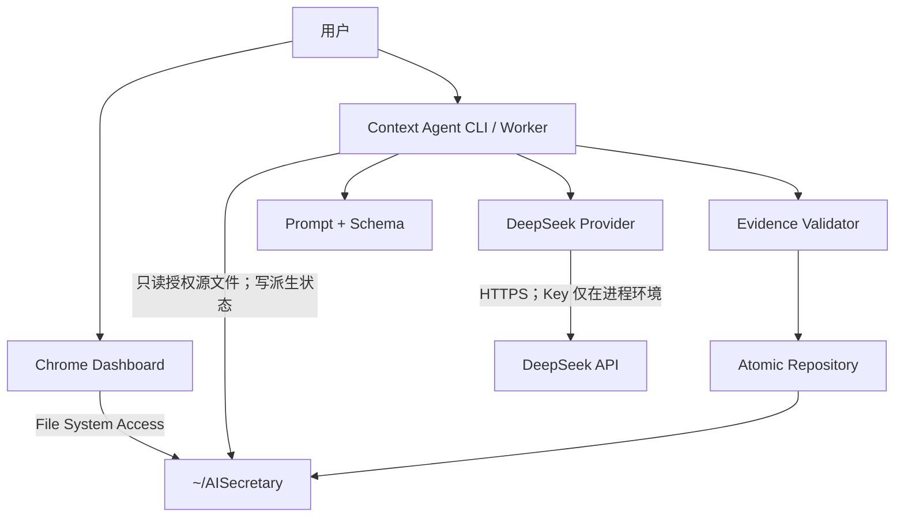
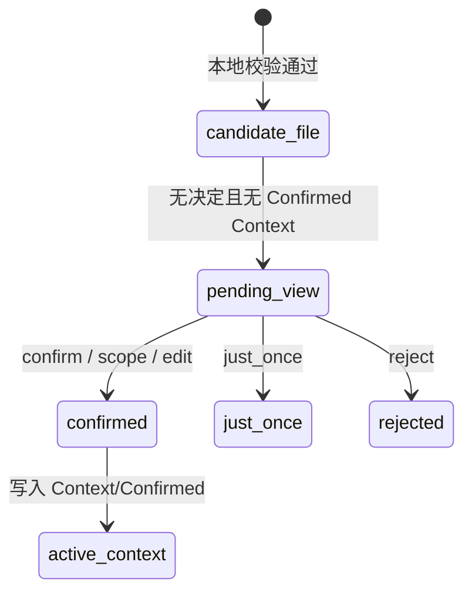

# Memento Context Agent MVP 技术设计

> 文档状态：P1.0 实现合同（按当前代码对齐；测试与真实 API 状态见最终评测报告）
> 默认 Provider：DeepSeek
> 默认模型：`deepseek-v4-pro`（CLI 可切换 `deepseek-v4-flash`）
> P1.1 设想单列为已知限制，不作为本次完成定义。

## 1. 设计目标

实现一条证据优先、可恢复、可切换 DeepSeek 模型的 Context 管线：

```text
授权源文件
  -> 不可变输入快照
  -> Provider 结构化生成
  -> 本地确定性校验
  -> 用户决定
  -> 用户决定与本地完整提交
  -> 只读 Context 包
```

模型只能提出候选，不能直接写入长期 Context。所有事实性保证由本地代码、文件哈希和状态机提供。

## 2. 组件边界



| 组件 | 职责 | 不负责 |
|---|---|---|
| Context Agent CLI/Worker | 编排快照、生成、校验、决定、Context 包与评测命令 | 持久保存 API Key、修改原始记录 |
| DeepSeek Provider | HTTP 请求、响应解析、usage 和错误归一化 | 判断证据是否真实、决定是否确认 |
| Evidence Validator | Schema、类别、敏感边界、哈希、行号和逐字引文校验 | 修补模型输出或猜测正确证据 |
| `core.py` 持久化层 | 幂等 ID、来源哈希、候选级锁、临时写入与 create-if-absent | 跨 CLI/浏览器的统一 CAS、撤回与版本管理 |
| Chrome Dashboard | 展示候选/证据、直接写入用户决定与 Confirmed Context、预览 Context 包 | 持有 Key、直接发起模型调用 |
| Evaluation Runner | 离线夹具、可选真实 API 对照和成本汇总 | 把合成评测解释成真实用户价值 |

## 3. 仓库与用户目录

### 3.1 当前仓库结构

```text
context-agent/
├── context_agent.py            # CLI 入口与编排
├── deepseek_provider.py        # Provider 适配器
├── core.py                     # Prompt、Schema、证据、持久化、pack 与价格
└── eval/cases/*.json           # 合成评测用例

tests/
├── test_context_agent.py
└── test_context_agent_library.js
```

Python 的 Prompt、Schema 与价格默认值以 `core.py` 为事实源。Dashboard 为纯浏览器数据层，必须通过互操作测试保持字段兼容；当前仍存在 Python/JavaScript 双实现漂移风险，P1.1 应生成共享 Schema 或增加跨端 fixture 测试。

### 3.2 `~/AISecretary` 数据布局

```text
~/AISecretary/
├── YYYY-MM-DD.md                         # 原始事实，只读
├── Context/
│   └── Confirmed/
│       └── <candidate_id>.json           # 用户拥有的已确认 Context；ID 与候选相同
└── .context-agent/                       # 可重建运行层
    ├── runtime/                           # 安装后的 Python CLI/worker
    ├── candidates/<candidate_id>.json
    ├── decisions/<candidate_id>.json
    ├── usage/YYYY-MM.ndjson
    └── locks/<candidate_id>.lock
```

数据分层：

- `Context/Confirmed/` 是用户确认的数据；升级和卸载默认保留。
- `.context-agent/` 是候选、决定与 Provider 用量数据；删除后不应损坏原始记录。
- 已确认 Context 的来源证据依赖原始日级文件。若原始文件被用户删除，应显示“来源缺失”，不能伪造可追溯状态。

MVP 不单设 `runs/`、`one-shot/` 或 `events/`：生成元数据随候选保存；“只是这次”把 `one_time_context` 嵌入决定文件，CLI 返回且 Dashboard 可重建单次包，但不记录消费/过期状态。撤回、独立事件流和完整审计属于 P1.1。

## 4. CLI 合同

仓库内入口为 `context-agent/context_agent.py`；安装后入口位于 `~/AISecretary/.context-agent/runtime/context_agent.py`。以下使用仓库路径示例：

```bash
# 生成零条或一条候选；只有本命令访问 Provider
python3 context-agent/context_agent.py generate \
  --vault /path/to/AISecretary \
  --source 2026-08-08.md --source 2026-08-09.md

# 对候选提交用户决定
python3 context-agent/context_agent.py decide --vault /path/to/AISecretary \
  --candidate <candidate_id> --action confirm
python3 context-agent/context_agent.py decide --vault /path/to/AISecretary \
  --candidate <candidate_id> --action just_once
python3 context-agent/context_agent.py decide --vault /path/to/AISecretary \
  --candidate <candidate_id> --action scope --scope "Memento"
python3 context-agent/context_agent.py decide --vault /path/to/AISecretary \
  --candidate <candidate_id> --action edit --statement "..."
python3 context-agent/context_agent.py decide --vault /path/to/AISecretary \
  --candidate <candidate_id> --action reject

# 为当前任务生成只读包，不调用模型
python3 context-agent/context_agent.py pack --vault /path/to/AISecretary \
  --scope "Memento"

# 评测
python3 context-agent/context_agent.py eval
python3 context-agent/context_agent.py eval --live --vault /path/to/AISecretary \
  --model deepseek-v4-pro --model deepseek-v4-flash
```

`MEMENTO_VAULT` 可替代重复的 `--vault`。`generate`、`validate`、`decide` 和 `eval` 输出 JSON；未指定 `--output` 的 `pack` 直接输出 Markdown。P1.0 退出码为：`0` 表示命令成功或 eval 全部通过，`1` 表示 eval 有失败样例，`2` 表示合同、Provider 或运行时错误。P1.0 没有 `revoke` 或 `audit` 命令，也没有更细的错误退出码。

## 5. Provider 接口与 DeepSeek 实现

### 5.1 P1.0 Provider 接口

P1.0 没有抽象 `Protocol`；`DeepSeekProvider.complete(messages)` 接收 OpenAI 格式消息，并返回：

```python
CompletionResult(
    content: str,
    usage: Mapping[str, Any],
    request_id: str | None,
    model: str,
)
```

`context_agent.py` 负责把 `content` 解析为 JSON，再交给 `core.py` 做严格校验。Provider 只接受 `choices[0].finish_reason="stop"` 的完整响应，并读取 `message.content`、`usage`、`id` 与 `model`。长度截断或其他结束原因转成安全 `ProviderError`；该异常只可携带结构化 `usage`、`request_id` 与 `model`，不能携带上游响应正文。

该边界已经允许 Pro/Flash 共用业务合同，但还不是任意 Provider 可插拔接口。接入其他供应商时应新增适配器，而不是让业务层读取其专有字段。

### 5.2 DeepSeek Provider

MVP 使用 Chat Completions 兼容接口。运行时配置：

| 配置 | 默认/来源 | 约束 |
|---|---|---|
| Base URL | `https://api.deepseek.com` | 可通过测试配置替换；正式运行只允许 HTTPS |
| Endpoint | `/chat/completions` | 封装在 Provider 内 |
| Model | `deepseek-v4-pro` | CLI 仅允许 Pro 或 Flash；不从环境读取模型名 |
| API Key | `DEEPSEEK_API_KEY` 环境变量；macOS 钥匙串回退 | 环境变量优先；两者都缺失时配置失败；不得回显 |
| Response format | JSON object | 返回后仍必须做本地 Schema 校验 |
| Streaming | 关闭 | MVP 只提交完整 JSON，避免半份候选 |
| Max output | 1200 tokens | P1.0 固定在 Provider 内 |
| Thinking | `disabled` | CLI 可改为 `enabled`，并可选 `high`/`max` reasoning effort |

请求 Header 中的密钥只在内存中构造。异常对象、日志、测试快照与命令输出必须经过脱敏；任何包含 `Authorization` 或环境变量值的对象都不能序列化到磁盘。

模型名和 API 行为可能随 Provider 更新而变化，发布前应以当时的 DeepSeek 官方文档和一次真实集成测试重新确认。

官方接口参考：[Create Chat Completion](https://api-docs.deepseek.com/api/create-chat-completion/)。

### 5.3 P1.0 错误与重试

Provider 将 HTTP 错误、连接失败、超时和无法识别的响应转换为不含密钥/响应正文的 `ProviderError`。P1.0 不自动重试，所有错误都使本次命令退出且不产生候选。对于可解析但 `finish_reason != "stop"` 的响应，`generate` 会先把异常携带的 usage 写入月度日志，再返回失败；live eval 同样累计 Token/成本并写日志，但把该 case 记为 `provider_error` 后继续。对 429、超时和 5xx 增加有上限的退避重试属于 P1.1；没有真实故障数据前不知道合适的重试次数。

## 6. 输入快照

P1.0 只读取 vault 根目录下的 `YYYY-MM-DD.md`。显式 `--source` 可重复；未指定时选择按文件名排序后的最近 7 个。默认总字符上限为 80,000，两个值都可通过 CLI 调整；超限直接失败，不静默截断。

来源快照持久化为候选中的 `source_hashes`：

```json
{
  "file": "2026-08-09.md",
  "sha256": "<64 lowercase hex>"
}
```

规则：

1. 只接受 `~/AISecretary` 根目录下符合日期命名的普通文件；解析真实路径后再次确认没有逃逸根目录。
2. 以原始字节计算 SHA-256，再以 UTF-8 严格解码；解码失败即阻塞本轮。
3. 行号从 1 开始，证据引文必须与对应整行逐字完全相等；P1.0 不接受子串或跨行引文。
4. Provider 返回后、正式候选写入前重新计算源哈希；变化则以冲突退出。
5. 原始文件只以只读方式打开，任何 Context Agent 命令都不得对其写入。

80,000 字符与最近 7 个文件是实现默认值，不是经过真实记录分布证明的最优参数。它们对质量和成本的影响尚未验证，评测报告必须记录实际输入 Token；P1.1 再增加调用前预览与更细的选择策略。

## 7. 候选输出 Schema

Provider 只允许返回以下两种状态。

### 7.1 正常无候选

```json
{
  "schema_version": "1.0",
  "status": "no_candidate",
  "candidate": null
}
```

### 7.2 候选

```json
{
  "schema_version": "1.0",
  "status": "candidate",
  "candidate": {
    "statement": "在 Memento 项目中，先验证 Context 的真实复用，再扩展输入设备。",
    "category": "project_decision",
    "scope": "Memento",
    "why_now": "近期记录中出现了明确决定和支持它的约束。",
    "uncertainty": "low",
    "sensitive": false,
    "evidence": [
      {
        "file": "2026-08-09.md",
        "line": 12,
        "quote": "先证明 Context 能在未来任务里复用，再扩展更多输入。"
      }
    ]
  }
}
```

硬约束：

- `category` 仅允许 `project_decision`、`constraint`、`work_preference`。
- `uncertainty` 仅允许 `low`、`medium`；高不确定性必须返回 `no_candidate`。
- `sensitive` 必须为 `false`；缺失、`true` 或类型不符均拒绝。
- P1.0 敏感词法后备仅扫描 `statement`、`scope`、`why_now` 的合并文本：英文不区分大小写，中文按词表匹配；它是有限拦截，不是完整分类器，也不扫描 `evidence.quote`。
- Python CLI 与 Dashboard 必须使用同一版词表和匹配语义；候选、用户 edit/scope 结果以及落盘 Confirmed Context 都不得绕过这条规则。
- `statement` 与 `why_now` 最长 400 字符，`scope` 最长 160 字符；三者必须是去除首尾空白后的非空字符串。
- `evidence` 必须有 1–5 条，且每条 `quote` 与 `file:line` 的原文整行完全一致。
- `work_preference` 至少需要来自两个不同日期文件的证据；确定性校验器强制执行该规则。
- 未声明字段按严格 Schema 拒绝，防止 Provider 输出悄悄扩大能力边界。

### 7.3 落盘候选（扁平 Schema）

模型通过校验后，候选对象被扁平写入 `.context-agent/candidates/<candidate_id>.json`：

```json
{
  "schema_version": "1.0",
  "id": "ctx_<24 hex>",
  "candidate_id": "ctx_<24 hex>",
  "status": "candidate",
  "created_at": "2026-08-10T12:00:00+00:00",
  "provider": "deepseek",
  "model": "deepseek-v4-pro",
  "generation_key": "gen_<24 hex>",
  "source_hashes": [
    {"file": "2026-08-09.md", "sha256": "<64 lowercase hex>"}
  ],
  "statement": "...",
  "scope": "Memento",
  "why_now": "...",
  "category": "project_decision",
  "evidence": [
    {"file": "2026-08-09.md", "line": 12, "quote": "整行原文"}
  ],
  "sensitive": false,
  "uncertainty": "low"
}
```

候选文件始终保留 `status=candidate`；“是否待处理”由相同 ID 的决定文件或 Confirmed Context 是否存在派生，不在候选文件内改写状态。

## 8. 本地证据校验

校验顺序固定：

1. JSON 可解析且根对象类型正确；
2. `schema_version`、字段集合、枚举、类型和长度满足合同；
3. 候选类别在允许列表，`sensitive` 为 `false`，且 `statement/scope/why_now` 不触发 P1.0 有限敏感词法；
4. `evidence.file` 是本轮 `source_hashes` 中的日级文件；
5. `evidence.line` 是从 1 开始且未超出文件行数的整数；
6. `evidence.quote` 与指定行整行完全一致；
7. Provider 返回后重读文件，SHA-256 与调用前快照仍一致；
8. 计算幂等标识并检查既有候选/决定。

任一步失败即整条候选失败。校验器不得用模糊匹配、编辑距离或另一次模型调用自动寻找“可能正确”的证据。

## 9. 标识、幂等与去重

所有哈希输入采用 UTF-8、字段排序后的 canonical JSON：

```text
generation_key = sha256({
  prompt_contract: "1.0",
  provider,
  model,
  source_hashes
}) 的前 24 个 hex，并加前缀 "gen_"

candidate_id = sha256({
  candidate: 候选全部字段（evidence 确定性排序）,
  source_hashes: 确定性排序
}) 的前 24 个 hex，并加前缀 "ctx_"

confirmed context id = candidate_id
```

规则：

- 相同候选与相同来源哈希得到同一个 `candidate_id`；已有完全相同文件直接复用。
- 同一候选已经存在决定后，CLI 重复相同 action 返回原决定；不同 action 或不同编辑内容冲突退出。
- P1.0 没有 `decision_request_id`，也没有跨 CLI/浏览器统一幂等请求协议。
- `generation_key` 当前只把 `schema_version` 当作 Prompt 合同版本；Prompt 文字改变时必须同步提升合同版本，否则可能无法区分两版生成策略。这是 P1.0 已知限制。
- 精确 ID 去重是工程保证；不同文字表达的语义重复只能作为评测指标，MVP 不承诺完全消除。

## 10. 状态机

P1.0 不持久化独立运行状态。`generate` 命令在进程内依次经历“读取来源 → Provider 调用 → usage 追加 → JSON/证据校验 → 候选 create-if-absent”；任一步失败都不写候选。

候选本身是不可变的 `status=candidate`。Dashboard 是否显示它由决定/确认文件派生：



`confirm`、`scope`、`edit` 同时产生决定文件和 `status=active` 的 Confirmed Context；`just_once` 产生包含 `one_time_context` 的决定文件；`reject` 只产生基本决定文件。P1.0 没有 `revoked`、`superseded` 或版本修订状态。

## 11. 决定与 Context Schema

### 11.1 决定事件

```json
{
  "schema_version": "1.0",
  "candidate_id": "ctx_<24 hex>",
  "action": "scope",
  "decided_at": "2026-08-10T12:00:00+08:00",
  "scope": "Memento"
}
```

`action` 允许 `confirm`、`edit`、`scope`、`just_once`、`reject`。`edit` 增加 `statement`，并可选增加 `scope`；`scope` 必须增加 `scope`；`just_once` 增加 `one_time_context`，其中包含 `statement`、`scope`、`category`、`evidence`、`source_hashes` 与 `original_candidate_id`；其他 action 不接受额外文本字段。P1.0 没有 `decision_id`、`decision_request_id` 或 `actor` 字段。

### 11.2 已确认 Context

```json
{
  "schema_version": "1.0",
  "id": "ctx_<24 hex>",
  "original_candidate_id": "ctx_<24 hex>",
  "status": "active",
  "confirmed_at": "2026-08-10T12:00:00+08:00",
  "decision_action": "scope",
  "statement": "...",
  "category": "project_decision",
  "scope": "Memento",
  "evidence": [
    {"file": "2026-08-09.md", "line": 12, "quote": "整行原文"}
  ],
  "source_hashes": [
    {"file": "2026-08-09.md", "sha256": "<64 lowercase hex>"}
  ]
}
```

若用户选择“改一下”，`statement` 使用用户文本，同时候选文件保留模型原文；若选择“限定范围”，正式 `scope` 使用用户范围。

## 12. 原子性、CAS 与并发

P1.0 分为两条写路径。

CLI 路径：

1. Provider 调用前计算 `source_hashes`，返回后再次核对；变化则不写候选。
2. 单个 JSON 在目标目录创建临时文件，完整写入、flush 并 `fsync` 文件。
3. 使用 hard link 做原子 create-if-absent；已有完全相同内容视为幂等，已有不同内容报冲突。
4. `decide` 按 Candidate ID 获取 `fcntl.flock`，再写 Confirmed Context（如需要）与决定文件。
5. 若进程在 Confirmed Context 写成后、决定写入前退出，重复相同决定会校验并复用既有 Context，再补写决定。
6. usage 使用追加打开与 `fsync`，不记录 Prompt/正文/Key。

Dashboard 路径：

1. 请求目录读写权限；
2. 使用页面串行队列与现有 Dashboard mutation lock；
3. 写显式临时文件并重新解析 JSON；
4. 浏览器支持 `FileSystemHandle.move` 时移动为正式文件，否则复制到 `createWritable()` 的正式文件后删除临时文件；
5. Confirmed Context 写成功后再写决定文件。

Confirmed-first、decision-second 是可恢复的提交顺序，不是跨两个文件的原子事务：两次写入之间，另一个进程可能只看到 Confirmed Context。重复同一动作可以校验并复用该 Context、补写决定，但不能据此宣称中间状态对所有进程不可见。

P1.0 没有父目录 `fsync`、`decision_request_id`，也没有 CLI 与 Dashboard 之间统一的 CAS/锁。Dashboard 回退复制路径可能覆盖同名文件，因此跨进程竞争不属于本次原子性保证；P1.1 应统一由本地 repository 提交。

## 13. 失败恢复

| 故障 | 正式状态 | 用户可见信息 | 恢复方式 |
|---|---|---|---|
| API Key 缺失 | 不变 | 需要在本地 worker 环境或 macOS 钥匙串配置密钥 | 配置后重试 |
| 401/403 | 不变 | 鉴权失败，不显示密钥或 Header | 更换/检查密钥后重试 |
| 429/超时/5xx | 不变 | Provider 调用失败 | P1.0 手动重试；不会自动重试 |
| 非 JSON/Schema 错误 | 不产生候选 | 模型结果未通过格式校验 | 保存无正文的错误类别；修 Prompt/模型后新运行 |
| `finish_reason != stop` | 不产生候选；若响应有 usage 则已先记录 | Provider 响应未正常结束，不显示正文 | `generate` 失败；eval 记 `provider_error` 并继续后续 case |
| 证据不匹配 | 不产生候选 | 候选证据未通过核对 | 不自动修补；进入评测失败样例 |
| 生成期间源文件变化 | 不产生候选 | 原始记录已变化 | 建立新快照与 `generation_key` 后重试 |
| CLI 与 Dashboard 同时决定 | P1.0 无统一 CAS 保证 | 可能出现同名文件竞争 | 停止并人工核对本地文件；P1.1 统一提交器 |
| CLI 临时文件写一半进程崩溃 | 正式文件保持旧版或不存在 | 可重试 | 陈旧临时文件不被读取为正式 JSON |
| Confirmed Context 已写、决定文件未写 | 暂时只存在 Confirmed Context | 本次决定未报告成功 | 重复完全相同动作，校验复用 Confirmed Context 后补写决定；它不是跨进程原子事务 |
| usage 日志失败 | 本次生成失败且不产生候选 | 成本记录失败 | 修复目录权限后重试；不能编造 Token |
| 候选/Context 来源被删或修改 | CLI 校验失败或 pack 计为 `invalid_skipped`；Dashboard 跳过 | 不展示、不允许决定、不进入包 | 重新生成候选；不自动修补旧证据 |

## 14. Browser Key Boundary

Chrome Dashboard 不包含 Provider SDK，也不读取 `DEEPSEEK_API_KEY`。它只做：

- 通过用户授予的 File System Access 读取待确认候选；
- 展示证据与状态；
- 在用户点击后直接写入决定 JSON，并在 confirm/edit/scope 时写 Confirmed Context；
- 读取已提交的本地状态；
- 在浏览器内确定性预览/复制 Context 包。

生成请求必须由本地 CLI/worker 执行。即使 Dashboard 代码被查看，用户密钥也不应出现。浏览器本地存储、IndexedDB、扩展配置、错误上报与源映射中均不得保存 Key。由于 Dashboard 直接写正式数据，它与 Python Schema 的互操作测试是 P1.0 必测项。

## 15. Context 包合同

MVP 的 Context 包是确定性、只读输出，不再调用模型：

```markdown
# Memento Context Pack

适用范围：Memento

## 在 Memento 项目中，先验证 Context 的真实复用，再扩展输入设备。

- 类型：project_decision
- 范围：Memento
- Context ID：ctx_...
- 证据：
  - 2026-08-09.md:12 — 整行原文
```

过滤规则：

- 只包含 `status=active`；
- CLI 未指定 `--scope` 时包含全部有效项；指定时只包含 `global` 或与参数字符串完全相等的范围；
- Dashboard 包含全部有效项，P1.0 不做范围过滤或逐条选择；
- `just_once` 不进入长期 pack；决定文件保存 `one_time_context`，CLI 返回，Dashboard 可重建、展示和复制独立的 One-time Context Pack；
- CLI 长期包包含证据整行与定位；Dashboard 长期包和单次包只输出已授权的 statement、scope、category 与 Context/Candidate ID，不复制原始引文；浏览器生成两类包前仍须回查来源 hash 与整行证据；
- 单次包目前可从决定文件重复重建，没有“复制/使用一次后消费”的状态；
- 包内顺序使用确定性排序，确保相同输入得到相同输出。

## 16. Token 与成本

### 16.1 使用日志

每次收到可解析的 Provider completion 后追加一行 NDJSON：

```json
{
  "schema_version": "1.0",
  "kind": "model_usage",
  "timestamp": "2026-08-10T12:00:00+00:00",
  "provider": "deepseek",
  "model": "deepseek-v4-pro",
  "request_id": "<provider response id or null>",
  "prompt_tokens": 1000,
  "prompt_cache_hit_tokens": 250,
  "prompt_cache_miss_tokens": 750,
  "completion_tokens": 200,
  "total_tokens": 1200,
  "reasoning_tokens": 20,
  "usage_missing": false,
  "cost_usd": 0.0005011563,
  "pricing": {
    "effective_date": "2026-08-09",
    "cache_hit_input_usd_per_million": 0.003625,
    "cache_miss_input_usd_per_million": 0.435,
    "output_usd_per_million": 0.87
  }
}
```

上例是字段示例，不是实测结果。真实调用使用 API 响应中的 usage；若只返回 `prompt_tokens` 而没有缓存分项，P1.0 为避免低估而把全部 prompt Token 计入 cache miss。若成功响应整体缺失 usage，仍追加一条不含正文的事件：`usage_missing=true`、各 Token 字段为 0、`cost_usd=null`。模型内容仍继续走 JSON/Schema/证据合同，因此可以产出候选或 `no_candidate`；这里的 0 Token 是缺失占位，不是一次免费调用。

日志禁止包含 Prompt、原文、候选正文、Authorization Header 或 API Key。

### 16.2 价格快照与计算

截至 2026-08-09 的 [DeepSeek 官方价格页](https://api-docs.deepseek.com/quick_start/pricing/) 快照：

| 模型 | Cache-hit 输入 USD / 1M tokens | Cache-miss 输入 USD / 1M tokens | 输出 USD / 1M tokens |
|---|---:|---:|---:|
| V4 Pro | 0.003625 | 0.435 | 0.87 |
| V4 Flash | 0.0028 | 0.14 | 0.28 |

DeepSeek 价格可能变化。价格必须使用带生效日期的配置并允许命令行覆盖；历史报告保留当时的 `price_version`，不能用新价格静默重算旧报告。

```text
estimated_cost_usd =
  prompt_cache_hit_tokens / 1_000_000 * cache_hit_input_rate
  + prompt_cache_miss_tokens / 1_000_000 * cache_miss_input_rate
  + completion_tokens / 1_000_000 * output_rate
```

DeepSeek 当前响应在 usage 中区分 `prompt_cache_hit_tokens` 与 `prompt_cache_miss_tokens`（若响应提供）。适配器分别记录后计算，不能把全部输入按 cache-hit 价格估算；若两者都缺失但存在 `prompt_tokens`，P1.0 会把全部输入按 cache miss 计算，作为避免低估的上界估算。若 usage 整体缺失，报告标记 `usage_missing`、把成本写为 `null`，并令 `cost_complete=false`；不能把缺失解读为免费调用。

## 17. 模型替换与廉价模型决策

P1.0 Provider 固定为 DeepSeek，模型可在 Pro 与 Flash 之间选择。两个模型经过同一 Prompt、Schema、证据、敏感边界与状态逻辑。

替换流程：

1. 固定同一版本评测集、Prompt 和价格快照；
2. V4 Pro 作为基线、V4 Flash 或其他模型作为 challenger；
3. 比较硬合同通过率、人工候选质量、延迟、Token 与成本；
4. challenger 只有在所有安全/证据硬门槛不下降时才可进入默认配置；
5. 保存逐样例差异，不能只比较平均分；
6. 模型名已进入 `generation_key`，Pro/Flash 不会复用同一个生成键；Prompt/Schema 策略变化时需要提升 `SCHEMA_VERSION`，P1.0 尚无独立 `generation_policy_version`。

基于上述价格快照，V4 Flash 的 cache-miss 输入和输出单价都比 V4 Pro 低约 67.8%，cache-hit 输入单价约低 22.8%。这只能证明单价差异，不能证明它已达到候选质量预期；是否可替换必须由配对评测回答。

## 18. 安全与隐私检查

- 源文件路径必须在解析后的 vault 根目录内；拒绝 symlink 逃逸。
- 请求/响应正文不写入 usage 日志或普通错误输出。
- API Key 不持久化到仓库、Vault 或应用日志；macOS 可由用户明确写入系统钥匙串。异常/traceback 需做脱敏测试。
- Prompt 将日记内容视作不可信数据，记录中的“忽略规则/调用工具”等文本不能改变系统合同。
- 模型输出永远不解释为路径、命令或代码执行指令。
- Dashboard 插入 HTML 前必须对用户/模型文本做转义，Context Pack 预览使用 `textContent`。
- 导出 Context 包前显示将包含的具体条目。

## 19. P1.0 已知限制

- 无撤回、修订版本、完整审计、使用事件或语义检索；
- `just_once` 可生成独立单次包，但不会在复制/使用后自动消费或过期；
- Provider 固定为 DeepSeek 且无自动重试；
- Python 与 Dashboard 各自实现数据校验，仍需互操作 fixture 防止 Schema 漂移；
- 敏感词法只检查 `statement/scope/why_now`，不是完整敏感分类器；两端词表与匹配语义仍需靠跨端测试防漂移；
- CLI 候选级锁不覆盖 Dashboard，浏览器回退写路径没有 create-if-absent CAS；
- Confirmed-first、decision-second 可恢复，但两文件对不是原子事务；
- 单文件写入没有父目录 `fsync`；
- usage 未返回缓存分项时按全部 cache miss 估算；整体缺失时 Token 占位为 0、成本为 `null`，本轮成本不完整；
- 未记录调用延迟，无法从当前 usage 文件计算 p50/p95；
- Prompt 没有独立版本号，暂时复用 `SCHEMA_VERSION` 进入 generation key；

## 20. P1.0 实现完成定义

技术实现只有同时满足以下条件才算完成：

- 文档、Python 与 Dashboard 的 `schema_version="1.0"`、扁平候选、决定和 Confirmed Context 字段一致；
- 合成 eval 覆盖正常候选、正常无候选、错误引文与敏感推断；更完整故障集保留在评测计划中；
- 原文不可变、调用后来源哈希复核、symlink 防逃逸、整行证据、CLI 幂等与单文件原子 create-if-absent 有自动化测试；
- Dashboard 不含模型调用和 Key 读取路径；
- Dashboard 在展示、决定和 pack 前回查来源哈希与证据；CLI pack 只包含有效且可回查的 Confirmed Context；
- Python 合同测试、Node 数据层测试、安装/打包合同测试和九个离线 eval case 通过；
- 可选真实 API 评测若未运行，在最终报告写 `not_run`；若运行，保存 API 返回的真实 usage，并与 fixture 成本分开；
- 安装器、升级与卸载分别验证运行文件和用户 Context 的保留策略；
- 实现差异已回写本文，不能让文档继续描述不存在的行为。
