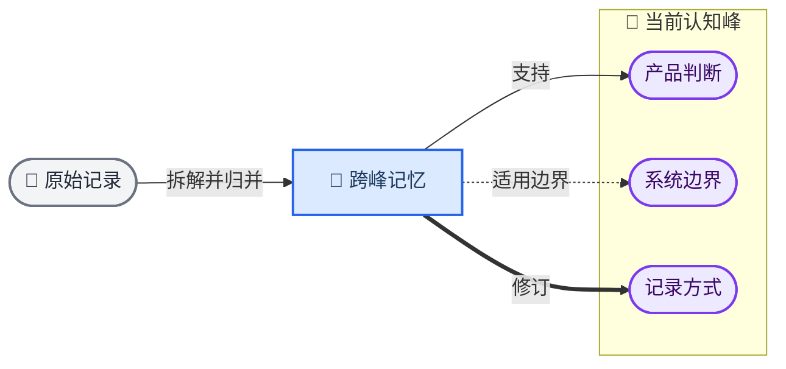

# Memento 认知地景：地形与跨峰连线拓展方案

_状态：拓展设计说明 · 日期：2026-08-17 · 依赖《Memento 认知地景 PRD》_

---

## 📋 方案摘要

本方案在现有认知地形上增加跨峰关系表达，用于呈现一条可用记忆同时参与两项或多项长期理解的情况。

地形继续表达长期理解及其证据积累；跨峰连线补充表达记忆点与多座认知峰之间已经确认的支持、反例、适用边界和修订关系。用户可以先感受整体认知结构，再通过点、线和右侧面板核对具体依据。

> **核心定义：** 跨峰记忆是同时拥有两条或更多有效 `memory → peak` 关系的可用记忆。它仍然是一条记忆，不新增内容层级，也不复制为多个节点。

### 方案位置

| 项目 | 说明 |
| --- | --- |
| **方案性质** | 认知地景的拓展能力 |
| **主要入口** | 认知地景的“概览”和“关系”视图 |
| **主要对象** | 已归并记忆、长期理解、已校验关系 |
| **解决问题** | 一条记忆同时关联多座认知峰时，地形聚类无法完整表达关系 |
| **保持不变** | 山峰、等高线、原文依据、版本历史和右侧详情面板 |

## 🎯 设计目标

### 用户需要看懂的内容

1. 哪些长期理解当前存在
2. 哪条记忆同时影响了多项理解
3. 每条连接属于支持、反例、边界还是修订
4. 这条关系为什么成立，以及依据来自哪段原文
5. 关系在什么时间形成，之后是否被修改或撤回

### 设计原则

- **先看地形，再看关系**：默认保留整体感，交互后展开精确信息
- **关系来自已保存数据**：视觉层不根据距离、颜色或文本相似度自行生成关系
- **一条记忆只出现一次**：通过多条边表达多归属，避免节点复制造成来源混乱
- **关系可回到原文**：每条线都必须能定位关系说明、记忆点和原始记录
- **位置保持稳定**：新增记录后不随意重排全部节点，帮助用户形成长期空间记忆
- **颜色只作辅助**：线型、箭头、标签和文字说明共同表达关系
- **概览保持克制**：连线按状态逐步显现，避免长期展示全量线团

## 🔗 核心结构

下图只说明对象关系，不代表最终页面坐标。认知峰位于地形区域中，跨峰记忆位于相关山峰之间的桥接区域，并通过多条关系线连接。



### 对象定义

| 对象 | 产品语义 | 地图表达 |
| --- | --- | --- |
| **认知峰** | 已提交并通过校验的长期理解 | 山峰中心、峰名、依据数量 |
| **普通记忆点** | 只关联一座认知峰的可用记忆 | 峰内实心点 |
| **跨峰记忆点** | 同时关联两座或更多认知峰的可用记忆 | 桥接区域中的实心点和细外环 |
| **等待归并记录** | 已初步整理、关系尚未确认 | 空心点，不绘制正式跨峰线 |
| **关系线** | 已保存的支持、反例、边界或修订关系 | 不同线型、方向和交互标签 |
| **原始记录** | 最终可核对的用户原文 | 进入右侧详情后展示，不直接铺在地图上 |

### 跨峰记忆的成立条件

一条记忆只有同时满足以下条件，才进入跨峰状态：

1. 已完成每日归并
2. 记忆表达足够原子化，可以用一句话准确描述
3. 拥有至少两条指向不同认知峰的有效关系
4. 每条关系具有关系类型、形成时间和原文依据
5. 关系已经通过现有 Workflow 校验并写入

如果一条原始记录包含多个相互独立的判断，应先拆成多个可用记忆，再分别建立关系。跨峰连线不用于掩盖拆解不足。

## 🎨 视觉语义

### 跨峰节点的位置

跨峰记忆优先放在相关山峰之间的鞍部或桥接区域。位置用于缩短连线、降低交叉和帮助定位，不承担人格相似度或重要性解释。

初始位置可以由相关峰中心的加权中心产生，再经过轻量避让得到稳定坐标：

- 两座峰：优先位于两峰之间，向主关系峰轻微偏移
- 三座峰：优先位于三峰中心形成的桥接区域
- 四座或更多峰：保持一个节点，使用选中态完整展开所有连线
- 关系新增或删除：优先保留原位置，只在遮挡严重时缓慢调整
- 时间回看：使用该历史版本中保存的位置或稳定位置种子

权重只参与排版。它不能决定关系是否成立，也不能自动提高某项理解的可信度。

### 节点样式

| 状态 | 节点表达 |
| --- | --- |
| **普通已归并** | 雾蓝实心小点 |
| **跨峰已归并** | 实心小点 + 一圈细外环 |
| **当前选中** | 外环扩大，出现轻微浅蓝晕影 |
| **等待归并** | 空心点，不显示跨峰外环 |
| **用户修正过** | 保留现有校正标记，与跨峰外环同时存在 |
| **历史版本** | 降低透明度，保持可点击或可从时间轴找回 |

跨峰状态不采用多色切片。当前 Memento 的主题数量会持续变化，多色节点容易把认知峰误读成固定人格分类，也会破坏浅色地形的克制感。

### 关系线样式

| 关系类型 | 线型 | 方向 | 默认标签 |
| --- | --- | --- | --- |
| **支持** | 细实线 | 记忆指向认知峰 | 支持 |
| **反例 / 张力** | 长虚线 | 记忆指向认知峰 | 反例 |
| **适用边界** | 短虚线 | 记忆指向认知峰 | 边界 |
| **修订** | 实线箭头 | 新依据指向被修订理解 | 修订 |

所有线使用雾蓝到中性灰的窄色域。关系类型主要依靠线型、箭头和文字标签区分。

### 连线显隐层级

| 页面状态 | 连线策略 |
| --- | --- |
| **概览默认态** | 只显示近期变化涉及的跨峰线；其余跨峰节点保留外环提示 |
| **悬浮跨峰记忆** | 显示该记忆连接的全部认知峰，其余对象降低透明度 |
| **选中跨峰记忆** | 锁定全部相关峰和线，右侧打开记忆及关系详情 |
| **悬浮认知峰** | 显示进入该峰的相关记忆，跨峰记忆同时保留通向其他峰的淡线 |
| **关系视图** | 展示当前时间范围内的已确认关系，支持按类型过滤 |
| **列表视图** | 使用文字列出一条记忆关联的全部峰和关系类型 |

## 👤 交互设计

### 点击跨峰记忆

1. 保持该记忆、所有相关认知峰和关系线为高亮状态
2. 其他山峰、记忆点和等高线降低视觉权重
3. 右侧面板显示记忆摘要、原文、来源和形成时间
4. 按认知峰分组列出每条关系及其说明
5. 提供“正确”“改一下”“仅保留原文”等现有校准操作

右侧面板示例：

```text
跨峰记忆
首页应该先展示 Memento 如何理解我

关联 3 项理解
· 支持「产品判断」——理解应成为首页第一信息
· 边界「系统边界」——展示仍需尊重用户控制
· 支持「记录方式」——理解和今天的记录需要同时存在

原始记录 · 08/17 09:42 · Chrome
```

### 点击关系线

点击关系线后，右侧面板切换为关系详情，至少显示：

- 关系类型
- 关系两端对象
- 形成原因
- 对应原文
- 形成时间和当前版本
- 用户修改记录
- 查看记忆、查看认知峰、查看原文

### 点击认知峰

点击认知峰时：

- 显示该峰当前全部有效依据
- 跨峰记忆使用外环标记
- 跨峰记忆通往其他峰的线保持较低透明度
- 用户点击某条跨峰记忆后，再展开它的完整多峰关系

### 键盘与文字替代

- 记忆点、认知峰和关系线均可通过 `Tab` 获得焦点
- `Enter` 或空格执行选择
- 焦点状态与鼠标悬浮状态保持一致
- 每条关系提供可读的 `aria-label`
- 列表视图提供与地图等价的完整信息，不以视觉位置作为唯一信息来源

## ⚙️ 数据要求

跨峰关系复用现有 `memory → peak` 多对多结构。视觉状态由已保存数据计算，不需要增加“跨峰记忆”实体。

### 建议数据结构

```json
{
  "memory": {
    "id": "mem_ui_understanding",
    "status": "committed",
    "summary": "首页应该先展示 Memento 如何理解我。",
    "source_record_ids": ["record_2026_08_17_0942"],
    "position_seed": "mem_ui_understanding"
  },
  "relations": [
    {
      "id": "rel_ui_product",
      "memory_id": "mem_ui_understanding",
      "peak_id": "peak_product",
      "type": "support",
      "state": "committed",
      "note": "支持理解成为产品首页第一信息",
      "created_at": "2026-08-17"
    },
    {
      "id": "rel_ui_system",
      "memory_id": "mem_ui_understanding",
      "peak_id": "peak_system",
      "type": "boundary",
      "state": "committed",
      "note": "提醒理解展示仍需保留产品边界",
      "created_at": "2026-08-17"
    }
  ]
}
```

### 视觉派生规则

```text
有效峰数量 = 去重后的 committed relation.peak_id 数量

有效峰数量 = 0 → 地图中不显示，或进入仍在观察区域
有效峰数量 = 1 → 普通记忆点
有效峰数量 ≥ 2 → 跨峰记忆点
```

候选关系、语义相似关系和等待归并关系不计入跨峰状态。它们可以在整理详情中作为候选项出现，完成校验后再进入地景。

## 🔄 状态与时间

| 状态 | 地景行为 |
| --- | --- |
| **新增关系** | 现有记忆获得跨峰外环，新连线在本次变化中出现 |
| **删除关系** | 当前视图移除该线；历史版本继续保留 |
| **关系修订** | 旧关系进入历史，新关系使用修订箭头和版本说明 |
| **峰合并** | 相关关系迁移到合并后的峰，并保留迁移记录 |
| **峰拆分** | 关系重新校验后分别连接新峰，不按空间距离自动分配 |
| **峰休眠** | 关系继续存在，当前视图降低峰和相关线的活跃度 |
| **归并处理中** | 继续显示上一版已提交关系 |
| **归并失败** | 保留上一版地景，不生成半完成连线 |

时间轴切换只改变当前查看的关系版本，不改写已经保存的长期理解。

## 🛡️ 产品边界

- 跨峰数量不表示记忆更重要、更真实或更具代表性
- 连线数量不用于生成用户评分或人格强度
- 峰间远近不表达两项理解必然相似或冲突
- 线条只呈现已经校验并保存的关系
- 语义相似度只可作为候选线索，不直接进入正式地景
- 一条记忆连接过多认知峰时，系统应先检查是否需要进一步拆解
- 首页不长期展示所有关系，完整关系进入“关系”视图
- 复杂 3D、持续运动、自由拖拽和全局力导向布局不属于本拓展方案

## ✅ 验收标准

### 功能验收

- [ ] 一条已归并记忆可以连接两座或更多认知峰
- [ ] 地图只保留一个记忆节点，不因多归属复制节点
- [ ] 支持、反例、边界和修订拥有可区分的线型或方向
- [ ] 点击跨峰记忆可以同时高亮全部相关认知峰
- [ ] 点击关系线可以查看关系说明、时间和原文
- [ ] 等待归并的内容不生成正式跨峰线
- [ ] 关系新增、修订和删除能够进入时间回看
- [ ] 归并失败时继续显示上一版关系

### 可理解性验收

使用至少 5 组真实或经过脱敏的认知案例进行测试，并确认用户能够：

1. 在 5 秒内识别一条记忆同时关联了多项理解
2. 正确区分支持关系与反例或边界关系
3. 从任意关系线进入对应原文
4. 说明节点位置和连线数量不代表人格重要性
5. 在概览态下仍能首先看见认知峰，而不会先被线条吸引

### 视觉验收

- [ ] 默认概览没有形成全局线团
- [ ] 跨峰节点与普通记忆点可以通过形状识别
- [ ] 线型在浅色背景和低对比度环境下仍可辨认
- [ ] 关系标签只在需要时出现，不长期覆盖地形
- [ ] 选中对象、相关对象和非相关对象拥有清楚的视觉层级
- [ ] `prefers-reduced-motion` 下不依赖持续动画表达关系
- [ ] 列表视图提供完整的等价文字信息

## 📍 版本范围

### 首个拓展版本

- 复用现有记忆与认知峰数据
- 识别两峰及以上的跨峰记忆
- 增加跨峰外环和稳定桥接位置
- 支持四类关系线
- 完成记忆、峰、关系线与右侧面板联动
- 在时间轴中呈现关系新增和修订

### 后续版本

- 峰合并、拆分和休眠后的关系迁移
- 大量关系下的类型筛选和分层展开
- 对同一记忆的关系争议与用户校准历史
- 从跨峰记忆进入“问过去的自己”与决策找回

## 🔗 与现有文档的关系

本文件只澄清“地形 + 跨峰连线”拓展方案。产品定义、双速整理流程、Agent 分工、认知地景生命周期和整体版本顺序继续以以下文档为准：

- [Memento 认知地景 PRD](./MEMENTO_COGNITIVE_LANDSCAPE_PRD.md)
- [Memento 认知秘书桌面 · 聚焦版 PRD](./MEMENTO_COGNITIVE_SECRETARY_HOME_FOCUSED_PRD.md)
- [Memento 认知地景离线 Demo](./demos/memento-cognitive-landscape/README.md)

当本文件与主 PRD 出现冲突时，优先更新主 PRD 中的产品语义，再同步调整本拓展说明。
