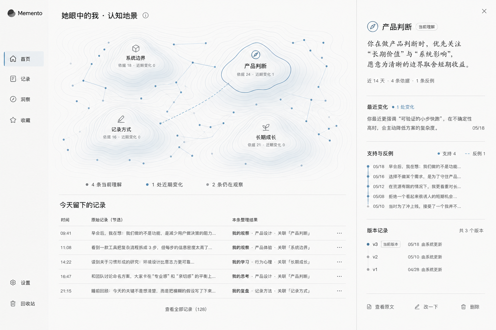
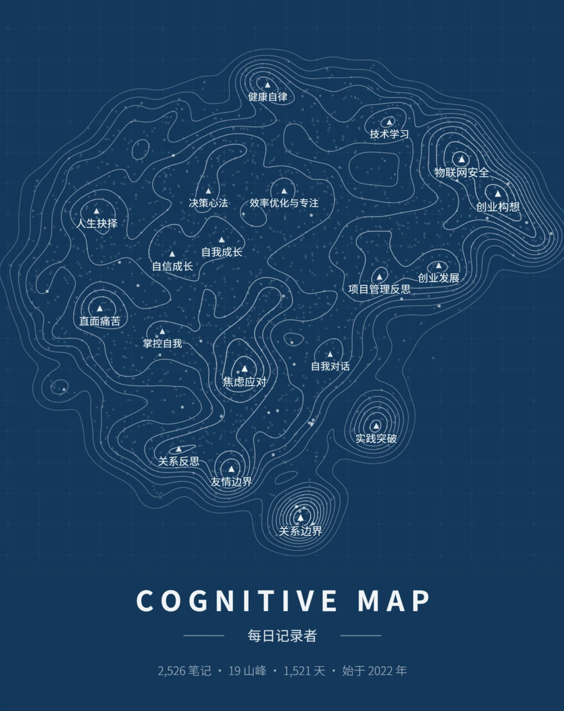

# Memento 认知地景 PRD

> 状态：产品方向稿
> 日期：2026-08-17
> 说明：本文用于指导后续产品验证与迭代，不代表相关能力已经上线。

## 0. 统一产品叙事口径

本文遵循 [Memento 产品叙事统一口径](MEMENTO_PRODUCT_NARRATIVE.md)，重点承接第二项价值 **“长期理解你的形状”**。认知地景呈现跨时间形成的主题关系；形成依据负责证明这些关系如何出现；少量长期判断进一步构成 Memento 对用户的当前理解。

地景是长期理解的可视化入口。下游的 **“可调用的个人记忆”** 会按任务读取相关主题、依据和长期判断，让每个 AI 都从同一个你开始。

## 1. 产品定义

Memento 是一个持续整理个人记录、形成可追溯记忆，并逐步更新对用户理解的个人认知秘书。

主页需要让用户同时感受到两件事：

1. 我今天留下的内容已经被接住并整理。
2. 这些内容正在怎样积累成一份可修订的长期理解。

### 1.1 视觉参考

#### Memento 认知地景意向图



这张图作为后续主页设计的主要模板，保留以下方向：

- 浅色底板与克制的雾蓝色；
- 主页上半部分为认知地景；
- 主页下半部分为今天整理后的记录；
- 山峰、记录点和关系线共同表达长期理解的形成过程；
- 点击山峰后从右侧打开理解、证据和版本面板。

图中的文字、山峰数量和具体数据均为演示内容，不代表当前真实产品状态。

#### 地形认知地图参考



这张图只用于参考地形隐喻和动态生长感：

- 山峰代表长期形成的认知取向；
- 等高线表达记录与证据的持续积累；
- 点和空间关系表达主题聚类；
- 整体地图让用户先感受到认知结构，再按需查看具体内容。

后续设计不直接复制深蓝背景、海报构图、统计口径和主题命名。地图中的每个视觉元素都需要对应可追溯的产品数据。

## 2. 当前事实

- 当前产品能够保存原始记录，并以手动或每日 21:00 的方式整理长期理解。
- 当前长期理解支持新增、强化、修订、张力、用户修改与删除，并保留原文依据。
- 生产版本尚未实现“每条记录即时整理”和“认知地景”两层能力。

## 3. 本轮目标

建立一条从日常记录到认知地景的完整用户链路：

```text
原始记录
→ 即时整理回执
→ 每日认知归并
→ 可用记忆与关系
→ 长期理解
→ 动态认知地景
→ 用户校准与结果回流
```

## 4. 主页信息层级

### 4.1 上半部分：认知地景

认知地景负责呈现 Memento 当前保留的长期理解，以及这些理解由哪些记录逐步形成。

- 山峰：一条已通过证据校验的长期理解。
- 点：一条整理后的可用记忆。
- 连线：支持、反例、修订或适用边界关系。
- 等高线：跨时间证据的积累。
- 淡色空心点：今天已初步整理、尚未完成每日归并的记录。
- 一个点可以连接多座山峰。

点击山峰后，从右侧打开理解面板；点击记录点后，定位到对应的今日记录。

### 4.2 下半部分：今天整理后的记录

首页默认展示整理结果，不直接铺开原始记录。

每条记录至少显示：

- 内容类型；
- 主题或对象；
- 后续用途；
- 当前整理状态；
- 关联的认知山峰。

点击记录后显示原文、来源、完整拆解、关联依据，以及“正确 / 改一下 / 仅保存原文”。

### 4.3 右侧面板：理解与证据

侧栏承载需要认真阅读和操作的内容：

- 当前理解与适用范围；
- 最近一次变化；
- 支持、反例与原始记录；
- 版本历史；
- 修改、删除和查看原文。

## 5. 双速整理工作流

### 5.1 即时整理

用户保存记录后，原文立即落盘；AI 随后返回一份轻量整理回执。

状态依次为：

```text
原文已保存 → 正在整理 → 初步整理完成 → 等待今日归并
```

即时整理可以给出候选主题和候选关系，但不能直接新增或修改山峰。

### 5.2 每日归并

每日 21:00 或用户点击“立即归并今日”后，系统统一处理当天记录：

1. 去重并检查当天记录之间的关系；
2. 查回历史记录和现有理解；
3. 确认记录与一个或多个山峰的关系；
4. 判断是否需要新增、强化、修订或形成张力；
5. 完成原文、反例和版本校验后更新地景。

## 6. Agent 层级

### 6.1 Record Interpreter

负责每条记录的即时拆解，生成可修改的初步整理结果。

### 6.2 Daily Integrator

负责当天记录的去重、关联、冲突检查和多主题拆分。

### 6.3 Memory Judge

只在长期理解可能变化时运行，决定新增、强化、修订、张力或停止。

### 6.4 Workflow

负责读取原文、执行检索、校验证据、维护版本和完成安全写入。Agent 提出判断，Workflow 控制实际执行。

## 7. 地景生命周期

| 状态 | 用户看到的变化 |
|---|---|
| 新理解 | 新山峰出现，并标明来自哪些记录 |
| 强化 | 原山峰增加一层等高线或证据点 |
| 修订 | 保留旧轮廓，显示新的范围或表述 |
| 张力 | 增加反例连线和“仍在权衡”状态 |
| 休眠 | 降低活跃度显示，历史仍可查看 |
| 用户删除 | 从当前地景移除，并保留删除记录 |

合并与拆分属于后续能力；初版优先保证新增、强化、修订和张力可信可用。

## 8. 产品边界

- 地景只呈现用户主动留下记录后形成的局部理解，不表达完整人格。
- 山峰高度表示证据积累，不表示重要性、真实性或人格强度。
- 地图中的近距离可以表示局部关联；远距离不作结论。
- 原始记录永远保留，AI 整理结果允许修改、撤回和重算。
- AI 生成的摘要不能作为长期理解的独立证据，最终依据必须回到原文。
- 没有新证据时，系统保持安静，不强行改变地图。

## 9. 迭代顺序

### 第一阶段：逐条整理可见

- 建立稳定的记录身份与整理状态。
- 在今日记录中展示即时整理回执。
- 支持正确、修改和仅保存原文。

### 第二阶段：每日归并

- 将当天记录统一归并为可用记忆。
- 建立记录与长期理解的多对多关系。
- 输出每日整理结果。

### 第三阶段：动态认知地景

- 将已校验的长期理解投影为山峰。
- 展示记录点、关系线、反例和版本变化。
- 打通山峰、侧栏和今日记录的联动。

### 第四阶段：持续校准

- 支持峰的合并、拆分和休眠。
- 将用户修改、删除和现实结果回流到后续判断。

## 10. MVP 验收

首个可用版本需要满足：

1. 用户保存记录后，可以看到原文已保存和即时整理状态。
2. 每条整理结果都能回到对应原文。
3. 一条记录可以关联零个、一个或多个山峰。
4. 新山峰只有在长期理解真正提交后出现。
5. 每次山峰变化都能解释新增了什么证据、反例或范围。
6. 用户修改或删除后，后续整理尊重用户版本。
7. 失败时原文不丢失，页面能够说明“已保存，尚未完成整理”。

## 11. 核心观察指标

- 即时整理完成率；
- 用户修改与“仅保存原文”的比例；
- 每日记录进入可用记忆的比例；
- 记录被长期理解实际引用的比例；
- 山峰修改、删除和误生成比例；
- 用户从山峰返回原文的使用次数；
- 每周真正帮助找回、决策或修订判断的历史复用数。
