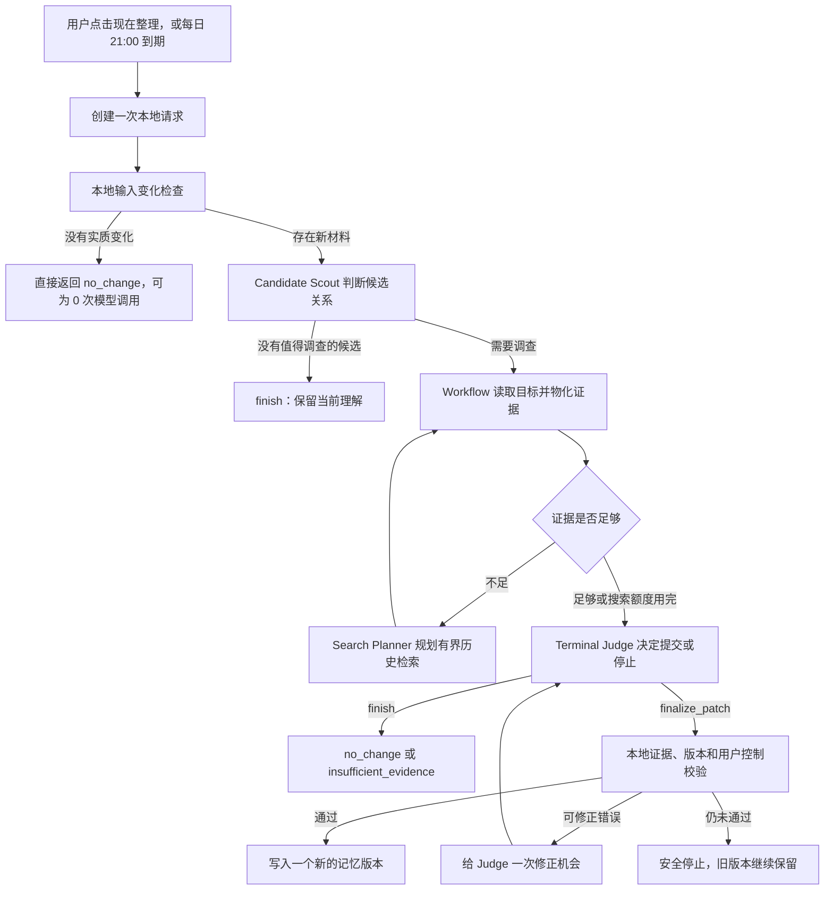

# Re:member Agent V1 兼容入口产品说明与验收指南

> 面向产品经理的实现说明与使用手册
>
> 当前工作区：Prompt `remember-agent-v1.22` / Workflow policy `agentic-workflow-investigation-v1.13` / stable-new identity `stable-new-identity-v1.1` / terminal gate `stable-new-terminal-gate-v1.0`
>
> 历史本机快照（2026-08-16 03:08，v1.20 / v1.11 当时状态）：提交 `2d2063b` 已打包并安装，Agent 总开关与每日 21:00 计划均已开启；调度器手动探活为 `not_due`，当时 21:00 的自然触发尚未发生
>
> 当前 v1.22 / v1.13 的两个冻结合成 case 已完成真实 DeepSeek v4 有限验收；这不能从历史安装快照推导为当前版本已安装或已开启
>
> v0.9.0 入口边界：本文中的“现在整理 / 检查最近 14 天”描述独立 Agent V1 兼容入口，不是认知主页的主流程。当前主页流程是“原文保存 → 逐条整理 → 归并今天 / 21:00 日流程 → 必要时长期判断”，详见 [`认知秘书 MVP 使用说明`](cognitive-secretary-mvp/USER_GUIDE.md)。

## 1. 一句话理解这个产品

在独立 Agent V1 兼容入口中，你可以点击“现在整理”发起一次近期理解核对。Agent 判断近期记录里有没有值得沉淀的人物理解，Workflow 查证、校验并安全写入“她眼中的我”。v0.9.0 认知主页不以该按钮为主流程。

它最终交付一组可以查看依据、继续修订和删除的长期理解，不生成对话式回答。

当前采用 **Agent 做关键语义判断，Workflow 控制工具、证据和写入** 的组合：

- Agent 决定有没有候选、候选与哪条旧理解有关、是否需要查历史、最后应该更新还是停止；
- Workflow 负责读取文件、执行检索、整理可引用证据、限制预算和调用次数；
- 本地校验器负责阻止伪造依据、错误覆盖、并发冲突和被用户删除的理解复活。

## 2. 用户实际看到什么

Chrome 新标签页右侧的“关于我”是产品入口。

页面包含：

1. **她眼中的我**：分为“反复出现的我”、“最近正在变化”和“仍在权衡”，空组不显示；
2. **查看依据**：支撑或反驳这条理解的日期、原文和行号；
3. **现在整理**：立即创建一次检查最近 14 个自然日的任务；
4. **每日 21:00 计划**：开关只保存本地配置，还需要 Agent 总开关与本地调度器正常；
5. **编辑 / 删除**：用户对长期理解拥有最终控制权；
6. **最近一次整理记录**：查看是否调用模型、经过多少判断和检索步骤，以及 Token 与成本。

仅打开页面、阅读理解或查看依据，不会调用 DeepSeek。

## 3. Agent、Workflow 与本地规则分别做什么

| 角色 | 负责的事情 | 不负责的事情 |
|---|---|---|
| 用户 | 决定何时触发、修改或删除 | 不需要编写 Prompt 或选择检索工具 |
| Candidate Scout（Agent） | 判断有没有值得调查的候选；选择 `new / reinforce / revise / tension`；绑定可能相关的旧理解；提出最多两个初始查询 | 不直接读写文件，不直接提交长期记忆 |
| Evidence Workflow | 读取目标理解、执行有界历史搜索、整理证据目录，并告诉 Agent 还缺什么 | 不替 Agent 编造结论，不自行决定记忆文案 |
| Search Planner（Agent） | 当现有材料不足时，决定是否继续搜索以及搜索什么 | 最多追加两次搜索，不能无限探索 |
| Terminal Judge（Agent） | 基于已物化的证据，决定 `finalize_patch` 或 `finish`；决定最终 statement、scope 和证据引用 | 不绕过来源、版本和用户操作校验 |
| 本地校验与写入器 | 校验 JSON、逐字引文、来源 hash、正反证据、目标版本、用户删改和并发冲突；通过后原子写入 | 不替模型补写结论；校验失败时不强行入库 |

四种候选关系：

- `new`：形成一条此前不存在的新理解；
- `reinforce`：新的记录继续支持已有理解；
- `revise`：当前方向已经发生变化，需要修订已有理解；
- `tension`：新旧证据同时成立，应该保留张力，暂时不能简化成单一结论。

## 4. 一次完整整理是怎么运行的



### 第 0 步：总开关和每日计划

全新安装的 Agent 总开关与每日计划都默认关闭。总开关允许 request / Worker / 编辑与删除；每日计划只在总开关开启时可保存和生效。开启任一开关本身都不调用 DeepSeek。

### 第 1 步：手动或 scheduled 触发

用户点击“现在整理”时，浏览器创建 manual request。每日 21:00 到期时，本地 schedule tick 在总开关、计划、到期、pending 和幂等检查后最多创建一条 scheduled request。两者进入同一 Workflow，DeepSeek Key 都不会进入浏览器。

Mac 睡眠错过 21:00 后，如 launchd 在醒来后补发任务，只补最近一个已到期时段，不逐日回填 backlog。错过时段后才开启计划，不补跑该时段。

### 第 2 步：本地先判断有没有输入变化

Workflow 会比较近期记录、历史水位、当前理解、用户修改与删除、策略版本等输入。

如果只是日期窗口自然滑动，或相对上一次结果没有实质变化，可以直接返回 `no_change`，不产生新的模型调用。

### 第 3 步：Agent 判断候选

Candidate Scout 先判断：

- 材料是否真的描述用户的稳定偏好、判断方式、工作方式或它们的变化/张力；
- 是否存在值得进入长期理解的内容；
- 它是新理解，还是对已有理解的加强、修订或张力；
- 如果关联旧理解，目标是哪一条；
- 是否需要用短查询核对更早历史。

这一步是 Agentic Workflow 的第一个关键判断节点。

纯产品规格、Agent / Workflow 运行、存储、测试、迁移、发布和维护状态应直接 `finish`；只有原文明确将它表达为用户的长期偏好、个人约束或反复做法时才可候选。这是 Agent 的语义判断，Workflow 不用关键词硬门替代。

### 第 4 步：Workflow 查证

Workflow 根据 Agent 的计划执行工具：

- 读取被选中的已有理解；
- 执行 Agent 提出的初始历史查询；
- 把结果转成带来源、日期、逐字引用和引用 ID 的 evidence bundle；
- 计算要完成 `new / revise / tension` 还缺哪些证据。

工具结果不能由模型伪造；只有 Workflow 实际读取到的内容才能进入最终引用集合。

### 第 5 步：必要时继续搜索

如果 evidence bundle 仍然缺少变化信号、跨日支持、旧方向或反例，Search Planner 可以追加历史查询。

当前每次任务最多追加两次搜索；每次搜索最多返回五条结果。搜索额度用完后必须进入最终判断，不能无限循环。

### 第 6 步：Agent 做最终判断

Terminal Judge 接收一个新的、只包含当前证据包的上下文，并选择：

- `finish`：没有变化，或证据仍不足；
- `finalize_patch`：提交一项可被本地校验的更新。

最终 patch 需要说明操作类型、目标理解、目标版本、statement、scope，以及采用哪些正向和反向证据。

这一步是 Agentic Workflow 的第二个关键判断节点。

当前 v1.22 / v1.13 在 complete envelope 基础上加入 stable-new identity v1.1 与 terminal gate v1.0：结构完备的稳定新理解必须进入合法提交，致命身份状态必须停止。两个冻结合成 case 已完成真实 DeepSeek v4 有限验收；该结果不外推真实用户 Vault 或纵向稳定性。

### 第 7 步：本地校验与写入

确定性程序会再次检查：

- 输出字段是否完整且没有多余字段；
- 引用是否来自本轮真实读取到的证据；
- 引文是否与原文件逐字一致；
- `revise / tension` 是否包含必要的变化或反向信号；
- 目标版本是否仍是 Agent 开始判断时的版本；
- 用户是否已经编辑或删除该理解；
- 原始记录是否在运行期间发生变化。

校验全部通过后，只写入一个主题的一次新版本。Agent 不修改 `YYYY-MM-DD.md` 原始日记。

## 5. 当前预算和边界

一次正式任务的默认上限：

- 最多 5 个模型回合；
- 最多 5 次受控工具动作；
- 累计 Token 执行停止阈值 40,000；
- Prompt 字符上限 180,000；
- 最多 2 个初始查询；
- 最多 2 次追加搜索；
- patch 校验失败后最多 1 次修正；
- 一次任务最多处理 1 个主题并提交 1 个 patch。

40,000 Token 是模型返回后的执行停止阈值。已经发生的 Provider 调用可能令实际累计量越过该数值，但越界 completion 不会继续执行工具或写入记忆。

## 6. 页面状态应该怎样理解

| 页面状态 | 产品含义 | 是否代表产生了新理解 |
|---|---|---|
| 整理能力已关闭 | 已校验的理解仍可阅读，触发、计划和写操作禁用 | 否 |
| 自动整理已关闭 | “现在整理”仍可使用，不会在 21:00 创建 scheduled request | 否 |
| 21:00 自动计划已保存 | `schedule.json` 已写入与复读；不代表 launchd 已执行 | 否 |
| 自动计划需要本地修复 | `schedule.json` 无效，页面拒绝覆盖并按关闭处理 | 否 |
| 正在核对近期记录 | 请求已提交，尚未获得终态 | 否 |
| 本次核对没有更新 | 任务正常结束，没有实质变化或证据不足 | 否 |
| 理解已更新 | 新版本已经通过来源和写入校验 | 是 |
| 本次核对没有完成 | 预算、Provider 或其他错误令本轮停止 | 否 |
| 当前只读显示上一版理解 | 新投影未通过完整校验，旧版本继续展示 | 否 |

“请求已保存”和“正在核对”都只是处理中，不能当作完成。

## 7. 你现在怎么使用

### 7.1 立即整理

1. 打开 Chrome 新标签页；
2. 点击右侧“关于我”；
3. 点击首屏“现在整理 / 立即检查最近 14 天”；
5. 如 Chrome 申请读写目录权限，选择允许；
6. 等待页面出现终态；关闭抽屉不会中断本地 Worker；
7. 重新打开“关于我”，查看结果和“最近一次整理记录”。

一次点击可能包含多次 DeepSeek 调用。调用次数由 Agent 的调查和修正路径决定。

### 7.2 修改一条理解

1. 点击理解卡片右上角 `···`；
2. 选择“编辑”；
3. 修改文字并点击“保存修改”；
4. 等到“你的修改正在保存”消失，再关闭手动整理。

编辑由本地流程保存，不需要新增 DeepSeek 判断，也不会修改原始日记。

### 7.3 删除一条理解

1. 点击理解卡片右上角 `···`；
2. 选择“删除”；
3. 再点击“确认删除”；
4. 等待页面重新投影，确认该理解消失。

删除只影响这条长期理解，原始日记仍然保留。同一个记忆 ID 不会被直接重新激活；近义的新表述仍可能在未来再次形成。

### 7.4 开启、查看和关闭

```bash
# 查看状态，不调用模型
python3 ~/AISecretary/.context-agent/runtime/context_agent.py agent-status \
  --vault ~/AISecretary

# 开启手动整理；开启本身不调用模型
python3 ~/AISecretary/.context-agent/runtime/context_agent.py agent-enable \
  --vault ~/AISecretary \
  --confirm enable-remember-agent-v1

# 关闭后仍可阅读，重新核对、编辑和删除会隐藏
python3 ~/AISecretary/.context-agent/runtime/context_agent.py agent-disable \
  --vault ~/AISecretary \
  --confirm disable-remember-agent-v1

# 查看每日 21:00 配置；不调用模型
python3 ~/AISecretary/.context-agent/runtime/context_agent.py agent-schedule-status \
  --vault ~/AISecretary

# 开启或关闭每日 21:00 计划；写配置本身不调用模型
python3 ~/AISecretary/.context-agent/runtime/context_agent.py agent-schedule-enable \
  --vault ~/AISecretary \
  --confirm enable-remember-agent-daily-21
python3 ~/AISecretary/.context-agent/runtime/context_agent.py agent-schedule-disable \
  --vault ~/AISecretary \
  --confirm disable-remember-agent-daily-21
```

关闭不会强行中断已经进入 DeepSeek Provider 的调用。需要关闭时，建议先等待当前核对或修改完成。

## 8. 产品经理怎样判断 Agent 做得对不对

不要只看“有没有写入”。一次正确的 `no_change` 可能比一次勉强写入更好。建议按下面七个问题逐项判断。

### 8.1 它是否识别了正确的候选

问：近期记录中是否真的出现了值得长期保留的新方向、重复原则、修订信号或张力？

- 有明确变化却直接 `finish`：能力上的漏判；
- 只有一次性安排却试图写入：候选选择过度；
- 没有实质变化并返回 `no_change`：合理结果。

### 8.2 它是否找对了旧理解

问：若本次是 `revise / reinforce / tension`，Agent 绑定的是否为同一决策范围内的旧理解？

- 绑定错主题，即使文字通顺也不能通过；
- 已有同范围理解却选择 `new`，可能制造重复或冲突记忆。

### 8.3 它是否在必要时调查了历史

问：关键证据不在最近 14 天内时，Agent 是否主动提出了有用查询？

- 需要旧方向或变化信号，却完全不搜索就停止：调查能力不足；
- 查询与候选无关，或连续搜索没有信息增益：规划质量不足；
- 当前证据已经充分，没有搜索：可以是更高效的正确路径。

因此不能用“工具越多越 Agentic”来判断质量。关键是工具是否解决了当前证据缺口。

### 8.4 最终结论是否忠于证据

问：最终 statement 是否准确表达最新支持证据，scope 是否与证据范围一致，是否遗漏反例？

- `revise` 应反映最新方向，并保留旧方向或变化信号作为可追溯依据；
- `tension` 应保留冲突，不能强行选边；
- `new` 需要足够稳定、跨日且可唯一命名的证据。

### 8.5 它是否尊重用户控制

问：用户编辑过的内容是否被覆盖？删除的同一记忆是否复活？并发修改是否触发安全停止？

这部分主要检验 Workflow 和本地写入器。即使 Agent 判断正确，只要覆盖用户操作，也属于产品失败。

### 8.6 它是否在合理成本内完成

展开“查看最近一次整理记录”，检查：

- 模型调用次数；
- 判断与检索步骤；
- Token 和成本；
- 是否出现无意义重复搜索或反复修正。

一次点击不等于一次 API 调用。当前架构允许 Scout、Search Planner、Judge 和一次 repair 分别产生调用。

### 8.7 它是否给出了正确的产品终态

最终只接受以下几类产品结论：

- 有可靠新版本：`updated`；
- 没有实质变化：`no_change`；
- 存在候选但证据仍不足：`insufficient_evidence`；
- 安全或运行异常：保留旧版本并明确失败状态。

出现错误时仍保持旧理解和原始日记不变，说明安全壳工作正常；它不能自动证明 Agent 的判断能力合格。

## 9. 三类典型任务应该出现什么路径

### 噪音或一次性记录

预期：Candidate Scout 选择 `finish`，或本地输入变化检查直接结束；结果为 `no_change`，不写入。

### 两个日期重复出现的稳定原则

预期：Agent 选择 `new`，Workflow 物化两个不同日期的逐字依据，Judge 提交新理解，本地校验通过后写入。

### 当前方向与旧理解发生变化

预期：Agent 选择 `revise` 并绑定旧理解；若关键替代信号在 14 日窗口外，Agent 应发起历史搜索；Judge 用新方向、旧方向和变化证据提交修订。

如果第三类任务反复在读到旧理解后直接 `finish`，说明历史调查或变化识别仍是能力瓶颈。

## 10. 当前已经做到什么程度

### 已经完成

- 已实现手动启用、“现在整理”和关闭；
- 已实现独立每日 21:00 调度、页面开关、同日幂等、pending 拦截、sleep/wake 最近时段补跑和无 backlog；
- 手动与 scheduled request 共用同一 Agentic Workflow、全局 mission lock 与入库链路；
- 人物窗口已按“反复出现 / 正在变化 / 仍在权衡”组织；
- Candidate Scout 已增加人物相关性边界，纯系统事实应停止；
- Candidate Scout、Search Planner、Terminal Judge 三阶段已接入；
- Workflow 能读取目标、执行有界搜索并构造可引用证据包；
- 本地来源、逐字引文、敏感信息、版本、CAS、用户编辑与删除门均已接入；
- Chrome 已能展示理解、依据、整理状态、用量，并支持编辑和删除；
- 历史 v1.19 / v1.9 完成过冻结四案真实 API、本机 request 和 Chrome 编辑/删除闭环；这些证据不追认当前 v1.22 / v1.13。
- 历史 v1.20 / v1.11 有两个人物相关性隔离真模型探针：纯系统说明负例最终 `no_change`，但有 4 次 invalid action（5 calls / 7,087 Token / $0.000979475）；显式个人偏好正例在修复 `required_identity` 合同错位后单次重跑为 `updated / new`（`investigate → finalize_patch`，2 calls / 2 tools / 2,879 Token / $0.00137025，两日各 1 条证据，来源 SHA 不变）。两个探针均未触碰真实 Vault，只证明两个合同样例。
- 当前 v1.22 / v1.13 的 v4 隔离合成 DeepSeek 两案为 `all_passed`：两日长期沉淀案 11 calls / 26,602 Token / $0.007166364；`original_only` 撤回案 6 calls / 11,851 Token / $0.002545011；合计 17 calls / 38,453 Token / $0.009711375，`invalid_action=0`。临时目录已清理，合成来源 hash 前后不变。
- 2026-08-16 的历史候选提交曾生成发布包并安装；69 / 69 个受管 Context Agent 与 Chrome 文件和当时 HEAD 一致。Agent 总开关、每日计划与 calendar job 当时均已核验；手动 kickstart 在未到期时返回 `not_due`、0 API。
- 同一历史安装快照在真实 Vault 完成过一次 manual request：`no_change`、`finish`、1 call / 4,253 Token / $0.001759633、0 搜索、0 写入；39 个原始 Markdown、资产和 Review 文件与安装前备份完全一致。

### 目前只得到部分证明

- 四个合成案例证明了核心路径可达，无法证明真实记录中的所有表达都能被正确识别；
- 安装环境中的真实用户数据只观察到一次 `no_change`，没有证明真实个人记录上的 `new / revise / tension` 都稳定；
- 删除能阻止同一个记忆 ID 复活，不能保证所有近义新表述永远不会再次出现；
- 当前成本来自少量任务，不能外推长期月度成本；
- Agent 走对一条路径，不能证明它普遍优于固定 Workflow。
- 当前 v1.22 / v1.13 的两个冻结合成 case 已通过；样本范围不足以证明真实个人记录、20 日纵向或稳定月度成本。

### 尚未完成

- 20 日真实模型纵向 E2；
- 大量真实个人记录上的准确率、漏判率和误写率；
- 稳态成本、延迟和错误率统计；
- 当前工作区版本的重新打包、本机安装、计划开启与真实 21:00 触发；2026-08-16 的状态只属于历史快照；
- 当前发行包、真实 Chrome 与真实用户 Vault 上的逐条、日归并和长期链路验收；
- production-ready 级别的长期运行证据。

## 11. 当前产品结论

当前工作区的目标产品形态是 **可立即触发、可选择每日 21:00、可追溯、可修改、可删除的 Agentic Workflow MVP**。代码已经具备双入口与安全写入链路；v1.22 / v1.13 的两个隔离合成 case 已通过，安装、开启、真实 Chrome、真实用户 Vault 和实际日历仍需分别验收。

历史失败账本证明了 Terminal Judge、身份和结构噪声等边界怎样被暴露。当前 v4 两案的逐条、日归并、Review、长期沉淀、投影和来源不变检查已在隔离合成 DeepSeek 运行中通过；它仍只是一组有限合同样本。

它还没有证明：面对长期、模糊、多主题的真实记录时，Agent 能持续稳定地选对候选、找到历史证据并形成高质量长期理解。

现阶段最有价值的使用方式是：

1. 需要时用“现在整理”，希望固定运行时再开启 21:00 计划；
2. 每次查看依据和最终变化；
3. 用真实记录积累“正确更新 / 正确不更新 / 漏判 / 误写”样本；
4. 把“计划已保存”与“21:00 已实际运行”分开记录，不用配置状态代替真实终态。

## 12. 当前本机怎样核对

本文保留 2026-08-16 03:08 的历史本机快照；对当前 v1.22 / v1.13 仍应重新分别检查：

1. `agent-status`：Agent 总开关是否合法开启；
2. `agent-schedule-status`：`schedule.json` 是否合法且 enabled；
3. `launchctl print gui/$(id -u)/com.memento.remember-agent-v1-schedule`：本地日历 job 是否载入；
4. `.context-agent/logs/remember-agent-v1-schedule.*.log` 和对应 response / run：21:00 是否真正运行并到达终态；
5. 原始 `YYYY-MM-DD.md`：运行前后不应被 Agent 修改。

只看到页面“21:00 自动计划已保存”时，只能报告“计划配置已保存”。
